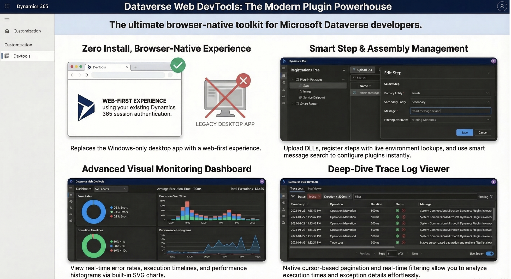

# Dataverse Web DevTools

A modern, browser-based developer toolkit for Microsoft Dataverse — built to replace the legacy desktop Plugin Registration Tool with a lightweight web-first experience that runs directly inside your Power Platform environment.


---

## Why?

The official Plugin Registration Tool is a Windows-only desktop app that requires installation, SDK binaries, and separate authentication. Dataverse Web DevTools brings the same capabilities to the browser — zero install, runs inside your Dynamics 365 / Power Platform environment using existing session auth, no app registrations needed.

## Features

### Plugin & Assembly Management
- Browse all registered plugin assemblies, plugin types, and steps
- Upload new assemblies (`.dll` files parsed in-browser)
- Update existing assemblies with new versions
- View assembly metadata: version, isolation mode, source type, public key token

### Step Registration & Configuration
- Register new plugin steps with full configuration
- Smart message search — exact matches shown first, then prefix, then partial
- Entity/message/stage/mode selection with live lookups from your environment
- Filtering attributes with searchable attribute picker
- Execution order (rank), deployment scope, impersonation (Run in User's Context)
- Enable/disable steps with one click
- Unsecure configuration editing
- Async auto-delete toggle

### Pre/Post Image Configuration
- Register pre-images, post-images, or both on any step
- Configure entity alias, message property, and attribute selection
- Attribute picker pulls available columns from your environment

### Service Endpoints & Webhooks
- Register, edit, and delete service endpoints and webhooks
- Full Service Bus support: Namespace Address, Queue/Topic/Event Hub, SAS Key & SAS Token auth
- Webhook support: HTTP Header, Webhook Key, HTTP Query String auth
- Message format (JSON / XML / .NET Binary) and User Information Sent configuration
- Register steps directly against service endpoints and webhooks
- Filter tree by type: Plugins / Webhooks / Endpoints

### Plugin Trace Log Viewer
- Full trace log viewer with real-time filtering and sortable columns
- Filter by: time range, plugin type, message, entity, mode, errors only
- Cursor-based pagination (handles Dataverse's `plugintracelogs` entity natively)
- Click any row to see full details: execution times, trace output, exception details, correlation IDs
- Copy trace output to clipboard
- Delete individual trace logs

### Monitoring Dashboard
- At-a-glance stats: total logs, error rate, avg duration, P95/max duration
- Success/Error donut chart
- Duration distribution histogram
- Top plugins by execution count (with error overlay)
- Execution timeline with adaptive time bucketing
- Interactive tooltips on all chart elements

### Organization Settings
- View and change the org-level trace log setting (Off / Exception / All) directly from the trace log viewer

### Tree View Modes
- **By Assembly** — traditional hierarchy: Assembly → Plugin Type → Step → Image
- **By Entity** — grouped by primary entity across all registered steps
- **By Message** — grouped by SDK message (Create, Update, Delete, etc.)
- Keyboard-navigable with expand/collapse all
- Real-time search filter across the tree
- Context menus with quick actions

## Screenshots



### Registrations Tree


### Edit Step Dialog


### Service Endpoint Registration


### Trace Log Viewer & Monitoring Dashboard


## Getting Started

### Option 1: Import Managed Solution (Recommended)

The easiest way to get started — no build tools needed.

1. Download the latest managed solution from [Releases](https://github.com/nickmeron/Dataverse-Web-Devtools/releases)
2. Go to your Power Platform environment → **Settings** → **Solutions**
3. Click **Import** and select the downloaded `.zip` file
4. After import, the DevTools web resource will be available in your environment
5. Navigate to your Environment Settings model-driven app to access it

### Option 2: Build from Source

If you want to customize or contribute:

```bash
# Clone the repo
git clone https://github.com/nickmeron/Dataverse-Web-Devtools.git
cd Dataverse-Web-Devtools

# Install dependencies
npm install

# Build for production
npm run build
```

The `dist/` folder will contain three files to upload as Dataverse web resources:

| Build Output | Web Resource Name | Type |
|---|---|---|
| `dist/index.html` | `nirmeron_devtools/devtools.html` | HTML |
| `dist/dataverse-devtools.js` | `nirmeron_devtools/dataverse-devtools.js` | Script (JS) |
| `dist/dataverse-devtools.css` | `nirmeron_devtools/dataverse-devtools.css` | Stylesheet (CSS) |

> **Note**: The HTML file references `ClientGlobalContext.js.aspx` for session authentication. All three web resources must be at the same directory level in Dataverse for this to work.

## Architecture

```
Browser (Dynamics 365 / Power Platform)
  └── Model-Driven App (Environment Settings)
        └── Web Resource (index.html)
              ├── Same-origin session auth via ClientGlobalContext.js.aspx
              ├── Dataverse Web API (OData v4) — /api/data/v9.2/
              │     ├── pluginassemblies
              │     ├── plugintypes
              │     ├── sdkmessageprocessingsteps
              │     ├── sdkmessageprocessingstepimages
              │     ├── serviceendpoints
              │     ├── plugintracelogs
              │     └── organizations
              └── No external APIs or app registrations
```

**Key design decisions:**
- **Zero-config auth** — runs as a web resource inside Dynamics, inheriting the user's active session
- **No backend** — pure client-side SPA communicating directly with the Dataverse Web API
- **No charting libraries** — monitoring dashboard uses pure SVG for minimal bundle size
- **Cursor-based pagination** — Dataverse's `plugintracelogs` entity doesn't support `$skip`, so we use `@odata.nextLink` for paging

## Tech Stack

| Layer | Technology |
|---|---|
| Framework | React 19 |
| Language | TypeScript 5.7 |
| Build Tool | Vite 6 |
| Styling | Tailwind CSS v4 |
| State Management | Zustand 5 |
| Data Fetching | TanStack React Query 5 |
| UI Primitives | Radix UI |
| Icons | Lucide React |
| Animations | Framer Motion |
| Notifications | React Hot Toast |
| Charts | Pure SVG (no library) |

## Project Structure

```
src/
├── app/                          # App shell, providers
│   ├── App.tsx                   # Main layout + routing
│   ├── AuthProvider.tsx          # Xrm context initialization
│   └── QueryProvider.tsx         # React Query setup
├── config/
│   └── constants.ts              # Dataverse enums, labels, mappings
├── features/
│   ├── assemblies/               # Assembly upload/update
│   ├── auth/                     # Xrm context service
│   ├── images/                   # Pre/Post image management
│   ├── steps/                    # Step registration, lookups
│   ├── trace-logs/               # Trace log viewer + monitoring
│   │   ├── components/
│   │   │   ├── TraceLogViewer.tsx
│   │   │   └── TraceMonitoringPanel.tsx
│   │   ├── hooks/
│   │   │   └── useTraceLogs.ts
│   │   └── stores/
│   │       └── traceLogStore.ts
│   └── tree-view/                # Registration tree + node rendering
├── shared/
│   ├── api/                      # Dataverse client, endpoints, query keys
│   ├── components/               # Layout, DetailPanel, Dialogs, etc.
│   ├── stores/                   # UI store (persist selected view, etc.)
│   └── types/                    # TypeScript interfaces for Dataverse entities
└── styles/
    └── globals.css               # Tailwind base + custom theme
```

## Development

```bash
# Start dev server with hot reload
npm run dev

# Type-check and build
npm run build

# Lint
npm run lint
```

> **Local development note**: The app requires `ClientGlobalContext.js.aspx` from a live Dataverse environment. For local dev, you'll need to run it as a web resource in your environment or mock the Xrm context.

## Deploying Updates

After building from source:

1. Go to your Dataverse environment → **Settings** → **Customizations** → **Web Resources**
2. Update each web resource with the corresponding file from `dist/`
3. Publish all customizations
4. Hard-refresh the browser to clear cached scripts

Or if using the managed solution approach, export/import a new solution version.

## Contributing

Contributions are welcome! Please:

1. Fork the repository
2. Create a feature branch (`git checkout -b feature/my-feature`)
3. Commit your changes
4. Push to the branch (`git push origin feature/my-feature`)
5. Open a Pull Request

## License

This project is licensed under the MIT License — see the [LICENSE](LICENSE) file for details.
